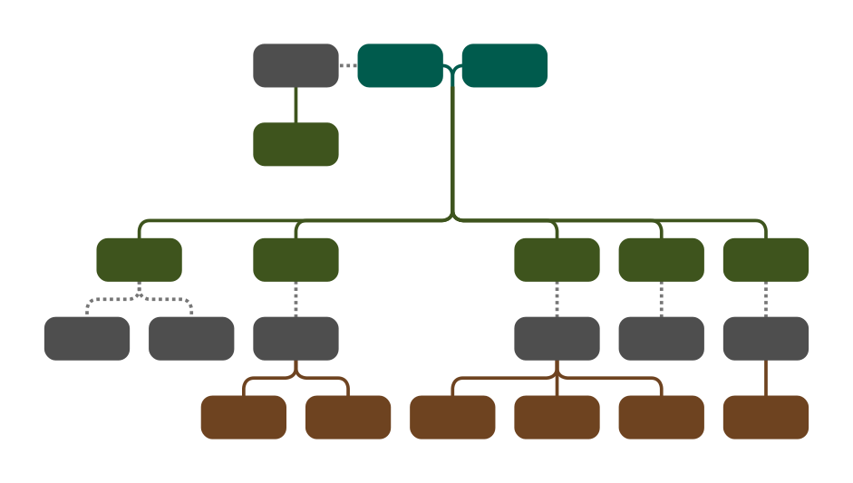

# Complete Family Tree Viewer

## Demo

If you would like to try out this application without downloading the code for yourself, it is available on my personal website: [Complete Family Tree Viewer](https://www.erikshelley.com/complete-family-tree-viewer). 

## About

### Purpose

### Design
#### Ancestors
#### Spouses
#### Children
Age order unless there are stacks, then stack comes first
#### Siblings
#### Inbreeding
#### Stacking

### Data Privacy
When you use this program, your genealogy information is not uploaded to my site. All processing is down in your browser. Feel free to review the code to confirm. In fact, after loading the page (and before selecting your Gedcom file), you can disconnect your computer from the internet and the application will continue to work.

If you don't have a Gedcom file of your own, download one of these [Gedcom sample files](https://github.com/D-Jeffrey/gedcom-samples) to use.

### Dependencies

### Reporting Issues

### Requesting Features

## Usage
- [Tree Content](#tree-content)
  - [Load Gedcom File](#load-gedcom-file)
  - [Select Root of Tree](#select-root-of-tree)
    - [Filter List](#filter-list)
    - [Select From List](#select-from-list)
  - [Configure Tree Size](#configure-tree-size)
    - [Generations Up](#generations-up)
    - [Generations Down](#generations-down)
    - [Maximum Stack Size](#maximum-stack-size)
    - [Hide Childless Inlaws](#hide-childless-inlaws)
- [Tree Styling](#tree-styling)
  - [Use Defaults](#use-defaults)
  - [Node](#node)
      - [Width](#width)
      - [Height](#height)
      - [X Spacing](#x-spacing)
      - [Y Spacing](#y-spacing)
      - [Rounding](#rounding)
      - [Show Names](#show-names)
      - [Show Years of BirthDeath](#show-years-of-birthdeath)
      - [Show Places of BirthDeath](#show-places-of-birthdeath)
  - [Links](#links)
    - [Thickness](#thickness)
    - [Rounding](#link-rounding)
    - [Text](#text)
    - [Size](#size)
    - [Brightness](#brightness)
    - [Text Shadows](#text-shadows)
  - [Colors](#colors)
    - [Hue Root](#hue-root)
    - [Saturation](#saturation)
    - [Luminance](#luminance)
    - [Highlight](#highlight)
    - [Transparent Background](#transparent-background)
    - [Background Color](#background-color)
- [Tree Viewer](#tree-viewer)
  - [Zoom](#zoom)
  - [Pan](#pan)
  - [Save PNG](#save-png)
  - [Save SVG](#save-svg)

## Tree Content
### Load Gedcom File
### Select Root of Tree
#### Filter List
#### Select From List
### Configure Tree Size
#### Generations Up
#### Generations Down
#### Maximum Stack Size
#### Hide Childless Inlaws

## Tree Styling
### Use Defaults
### Node
#### Width
#### Height
#### X Spacing
#### Y Spacing
#### Rounding
#### Show Names
#### Show Years of BirthDeath
#### Show Places of BirthDeath
### Links
#### Thickness
#### Link Rounding
#### Text
#### Size
#### Brightness
#### Text Shadows
### Colors
#### Hue Root
#### Saturation
#### Luminance
#### Highlight
#### Transparent Background
#### Background Color

## Tree Viewer
### Zoom
### Pan
### Save PNG
### Save SVG
