# Complete Family Tree Viewer

## Overview
This is a one-page application for viewing the complete family tree of any person in a [GEDCOM](https://en.wikipedia.org/wiki/GEDCOM) file. A person's "*complete family tree*" includes every one of their biological relatives and all of those relatives' spouses (in-laws).

- [Try it out online](https://www.erikshelley.com/complete-family-tree-viewer) 
- [Download the latest release](https://github.com/erikshelley/complete-family-tree-viewer/releases/download/v1.4.1/complete-family-tree-viewer-v1.4.1.zip) and try it out on your local device (unzip the file and open index.html in your browser)

If you don't have a GEDCOM file available, you can download one of these [GEDCOM sample files](https://github.com/D-Jeffrey/gedcom-samples). Feel free to ask questions, report issues, or request new features using the [issue tracker](https://github.com/erikshelley/complete-family-tree-viewer/issues).

## Contents
1. [Features](#features)
2. [Examples](#examples)
3. [Design](#design)
4. [Usage](#usage)
5. [Automated Testing](readme/Testing.md)
6. [Attributions](#attributions)
7. [Similar Repositories](#similar-repositories)

## Features
|                                          | Feature                       | Description |
| ---------------------------------------- | ----------------------------- | ----------- |
|  | **GEDCOM Import**             | Select and view a GEDCOM file from your local device. |
|        | **Data Privacy**              | No data is uploaded anywhere by this application. Processing is done in your browser. |
|       | **Complete Tree Viewing**     | View a complete family tree that has no crossing lines. Utilize [stacking](#stacking) to minimize tree width. |
|           | **Interactive Tree Viewing**  | Zoom and pan to view the tree as you would with a map. |
|         | **Customizable Tree Content** | Choose how many generations (unlimited), which relatives (everyone or pedigree-only), and what information (names, dates, places) to view. |
|         | **Customizable Tree Layout**  | Configure the positioning of in-laws (beside or below their spouse) and children (stackable). |
|      | **Customizable Tree Styling** | Customize sizes, spacing, colors, highlights, and shapes to fit your needs. |
|           | **PNG & SVG Exporting**       | Save the tree as a PNG or [SVG](https://en.wikipedia.org/wiki/SVG). |
|         | **Serverless Hosting**        | Save the application on your local device and run it without a web server. Simply open the HTML file in your browser. |

The application **does not** allow you to create or edit family trees. For that, you need to use some other genealogy applications or website that allows you to export your tree as a GEDCOM file. Here are some of the most popular options:
- Websites: [Ancestry](https://www.ancestry.com/), [MyHeritage](https://www.myheritage.com/), [Family Search](https://www.familysearch.org/) 
- Desktop Software: [RootsMagic](https://www.rootsmagic.com/), [Gramps](https://www.gramps-project.org/wiki/index.php/Main_page), [Legacy Family Tree](https://legacyfamilytree.com/), [GenoPro](https://genopro.com/), [Family Tree Maker](https://www.mackiev.com/ftm/)

## Examples
Here are a few examples trees to demonstrate some of the program's capabilities:

| Root&nbsp;Person | People&nbsp;Shown | Family&nbsp;Tree |
|:----------------:|:-----------------:|:----------------:|
| John&nbsp;Fitzgerald&nbsp;Kennedy | 202 People   | 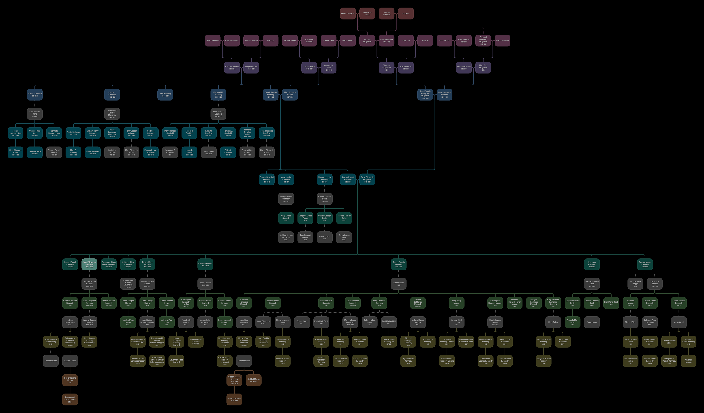 |
| Bart&nbsp;Simpson                 | 10 People    | 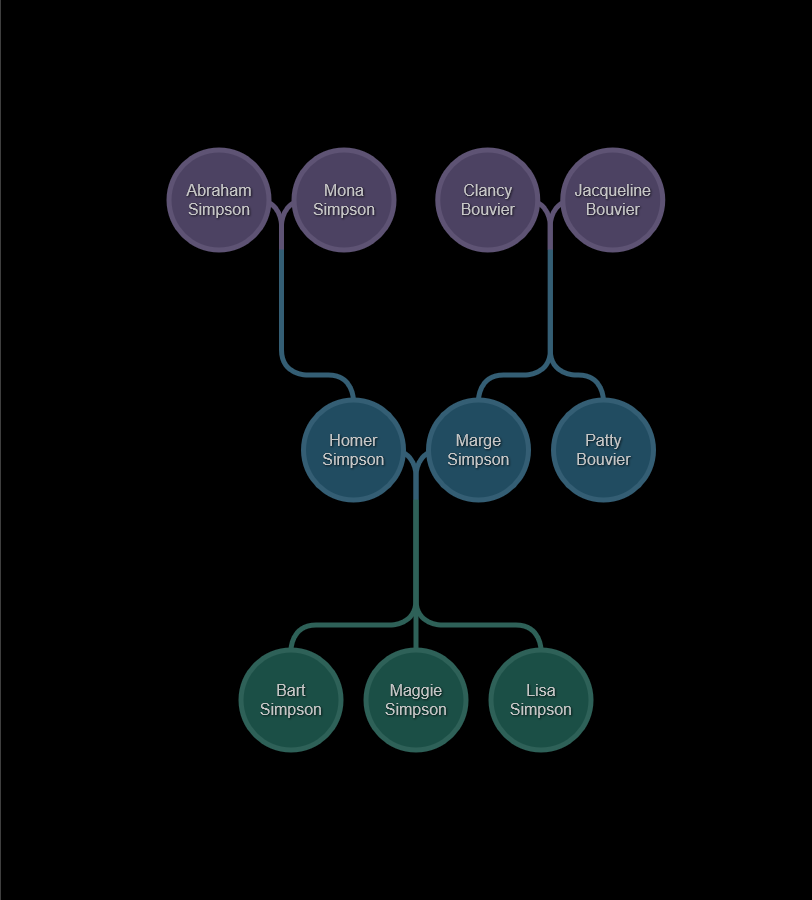 |
| Johann&nbsp;Sebastian&nbsp;Bach   | 32 People    | 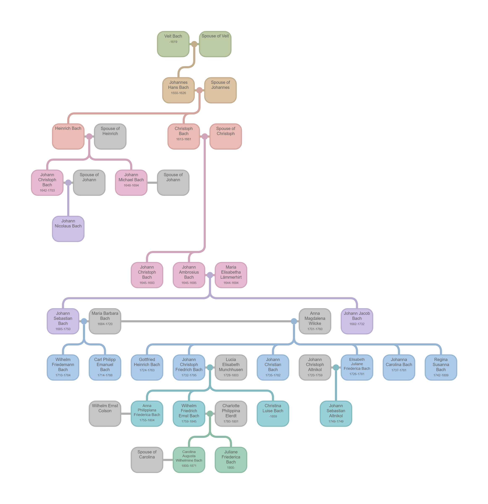 |
| Me                                | 4,798 People |  |

## Design
The table below describes how various relationships are depicted in the family trees.

| Relationship | Description | Example |
| ------------ | ----------- |:-------:|
| Ancestors | Ancestors are shown above their children with the father on the left and the mother on the right. This is similar to how other family tree programs work. Each generation is a different color. | 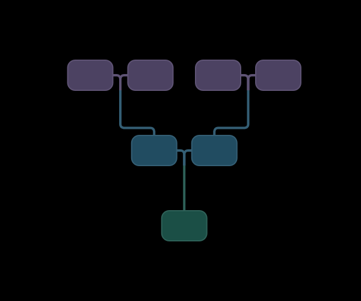 |
| In-Laws | In-laws are shown in grey and connected to their spouse using a grey line. If they are the spouse of an ancestor, they are displayed to the side of the ancestor. If they are not the spouse of an ancestor, they can be placed either next to or below their spouse. Placing them below can save horizontal space and make large trees easier to view. | In-Laws beside their spouses: 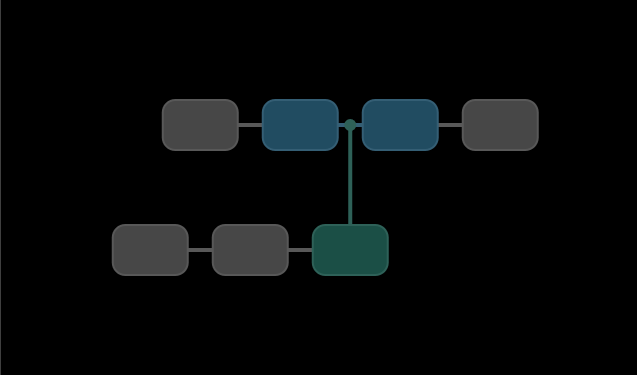 In-laws below their spouses:  |
| Descendants | Descendants (children & siblings) are placed below their parents. The placement depends on whether the in-laws are beside or below their spouses. | In-laws beside their spouses: 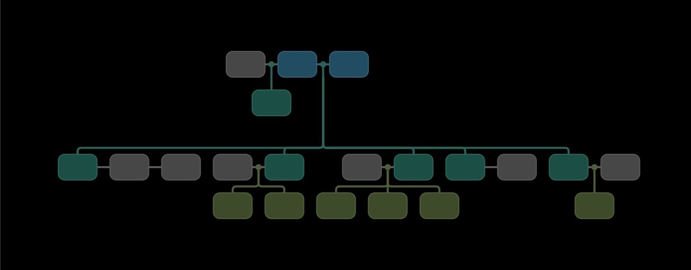 In-laws below their spouses:  |
| Inbreeding | Sometimes people who are related have children together. In this case they have common ancestors. Rather than show the common ancestors twice, a dashed line is used to connect one of the people to their common ancestors. In the example to the right, the root person's parents are first cousins. Their father's father and their mother's father are brothers. | 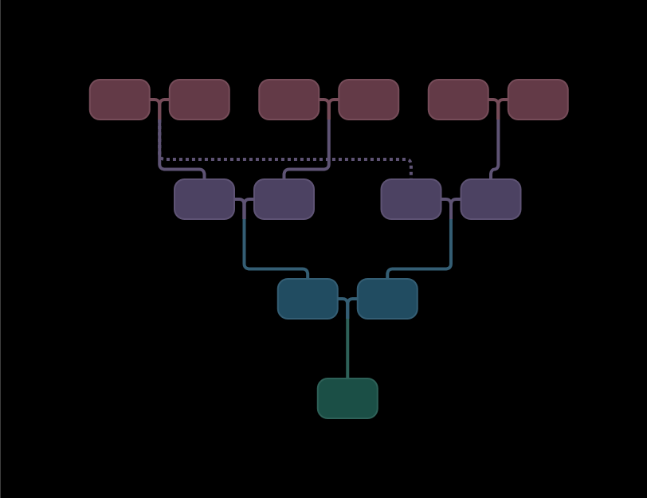 |

### Levels
To avoid having lines that cross, the concept of levels is introduced. Each generation of ancestors is at the top of a level with the root person being on the bottom level (level 1). All of the descendants of the ancestor's siblings and all of thte descendants of the ancestor's in-law spouses must fit in that level and not cross into the level below.

While this prevents crossing lines, it means not all people in the same generation are on the same level. To help with this problem each generation is given a color.

In the example below, the root person and all people shaded green are in the same generation. Their relationships to root are as follows:
- Level 1: siblings
- Level 2: 1st cousins / half siblings
- Level 3: 2nd cousins / half 1st cousins

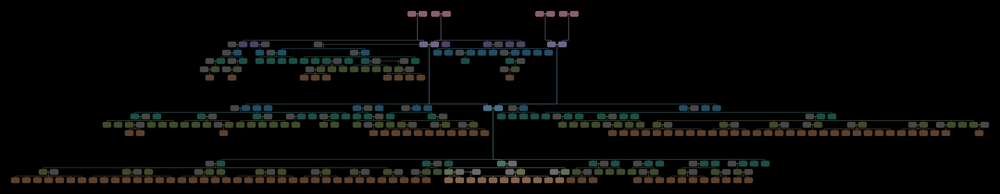

### Stacking
To avoid trees that are extremely wide, the concept of stacking is introduced. A person is defined as a leaf node if they have no in-law spouses and no children. Leaf nodes can be arranged in a column rather than being side-by-side. In the example to the right, notice how both siblings and spouses can be stacked. This program allows you to control the maximum stack size. A size of one means no stacking.

The example below contains the same people as the previous example in the **levels** section above. It takes up significantly less space.

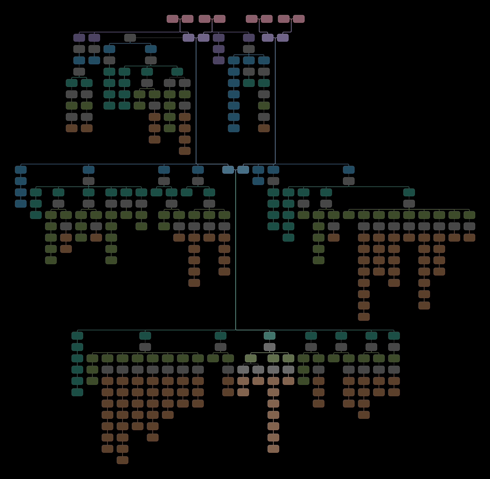

## Usage

### Tree Content
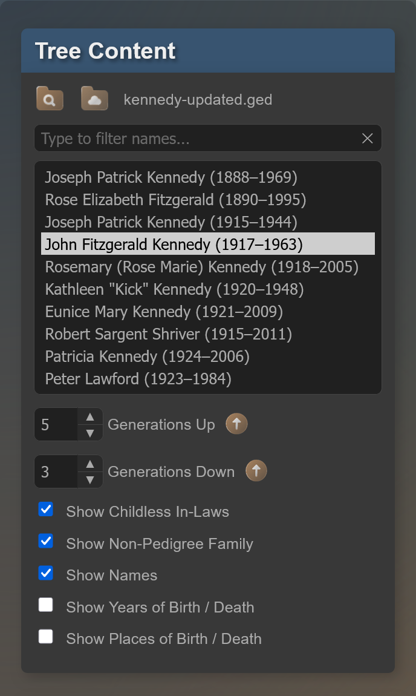

| Option | Description |
| ------ | ----------- |
|  | Click the Local Browse button to select and load a GEDCOM file from your computer. The people in thte GEDCOM file will be populated in the list below. |
|  | Click the Cloud Browse button to select and load a GEDCOM file from a short list of online sample files. The people in thte GEDCOM file will be populated in the list below. |
| Filter | Type a name in this box to filter the list of people. |
| Select Root Person | Click on a person to make the root of the tree. Their family tree will be drawn. |
| Generations Up | Change this value to control how many generations above the root person will be displayed. Click the up arrow  to use the maximum possible value for the root person. |
| Generations Down | Change this value to control how many generations below the root person will be displayed. Click the up arrow  to use the maximum possible value for the root person. |
| Stack Size | Change this value to control how many leaf nodes can be stacked in a single stack. Click the up arrow  to use the maximum possible value for the root person. |
| Position&nbsp;In&#8209;Laws&nbsp;Below&nbsp;Spouses | Click this checkbox to position in-laws below their spouses. If it is unchecked, they will be beside their spouses. |
| Hide Childless In-Laws | Click this checkbox to hide in-laws who are leaf nodes. |
| Hide Non-Pedigree Family | Click this checkbox to hide all people who are not direct ancestors or descendants of the root person, or spouses of the root person and their descendants. |

### Person Details
| Option | Description |
| ------ | ----------- |
| Show Names | Click this checkbox to show people's names in the tree. |
| Show Years of Birth / Death | Click this checkbox to show people's years of birth and death in the tree. |
| Show Places of Birth / Death | Click this checkbox to show people's places of birth and death in the tree. |

## Tree Styling
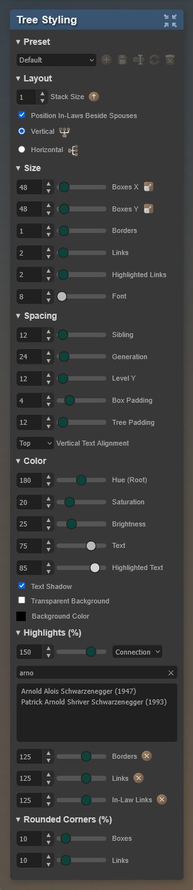

### Overall
| Option | Description |
| ------ | ----------- |
|  | Expand all tree styling sections. |
|  | Collapse all tree styling sections. |

### Preset
| Option | Description |
| ------ | ----------- |
| Preset | Select a preset to quickly change a number of the style settings and tree content. Use one of the five buttons below to change the presets. Your changes will only persist across sessions if you overwrite src/js/presets.js with the new file that gets downloaded after you click OK. The five buttons are only active if you load this application from a local file, not from a webserver. |
|  | Create a new preset |
|  | Save changes to the current preset |
|  | Rename the current preset |
|  | Reload the current preset |
|  | Delete the current preset |

### Size
| Option | Description |
| ------ | ----------- |
| Box X | Change this value to control the width of the nodes. Click the resize icon  to use the width needed to fit the text. |
| Box Y | Change this value to control thet height of the nodes. Click the resize icon  to use thhe height needed to fit the text. |
| Borders | Change this value to control the size of the node borders. |
| Links | Change this value to control how thick the links are between nodes. |
| Highlighted Links | Change this value to control how thick the highlighted links are between nodes. |
| Font | Change this value to control the size of the text in the nodes. |

### Spacing
| Option | Description |
| ------ | ----------- |
| Boxes X | Change this value to control the horizontal space between nodes. |
| Boxes Y | Change this value to control the vertical space between nodes. |
| Levels Y | Change this value to control the vertical space between levels. |
| Tree Padding | Change this value to control the padding around the tree. |
| Vertical Text Alignment | Choose whether text is aligned to the **Top** / **Middle** / **Bottom**. |

### Color
| Option | Description |
| ------ | ----------- |
| Hue Root | Change this value to control the hue used for the color of the root generation. |
| Saturation | Change this value to control how saturated the colors of the nodes are. |
| Brightness | Change this value to control the brightness of the tree nodes and links. |
| Text | Change this value to control how bright the text is in the nodes. |
| Highlighted Text | Change this value to control how bright the highlighted text is in the nodes. |
| Text Shadow | Click this checkbox to enable text shadows. |
| Transparent Background | Click this checkbox to use a transparent background for the tree. |
| Background Color | Click this control to choose a background color. The color will only be used if the Transparent Background checkbox is not checked. |

### Highlights (%)
| Option | Description |
| ------ | ----------- |
| Special | Change this value to control if the desired nodes are darker or brighter than everyone else. 0% is black, 100% is the same brightness as everyone else, and 200% is twice as bright as everyone else. Click the X icon  to use 100% for no highlighting. - **None**: No nodes are highlighted. - **Root**: The root node is highlighted. - **Pedigree**: The ancestors and descendants of root are highlighted. - **Connection**: Choose a second node from the tree and the path connecting them will be highlighted. |
| Borders | Change this value to control if the node borders are darker or brighter than the nodes. 0% is black, 100% is the same brightness as the nodes, and 200% is twice as bright as the nodes. Click the X icon  to use 100% for no highlighting. |
| Links | Change this value to control if the links are darker or brighter than the nodes. 0% is black, 100% is the same brightness as the nodes, and 200% is twice as bright as the nodes. Click the X icon  to use 100% for no highlighting. |
| In-Law Links | Change this value to control if the in-law links are darker or brighter than the nodes. 0% is black, 100% is the same brightness as the nodes, and 200% is twice as bright as the nodes. Click the X icon  to use 100% for no highlighting. |

### Rounded Corners
| Option | Description |
| ------ | ----------- |
| Rounding % | Change this value to control how rounded the corners of the nodes are. |
| Rounding % | Change this value to control how rounded the link paths between nodes are. |

## Tree Viewer
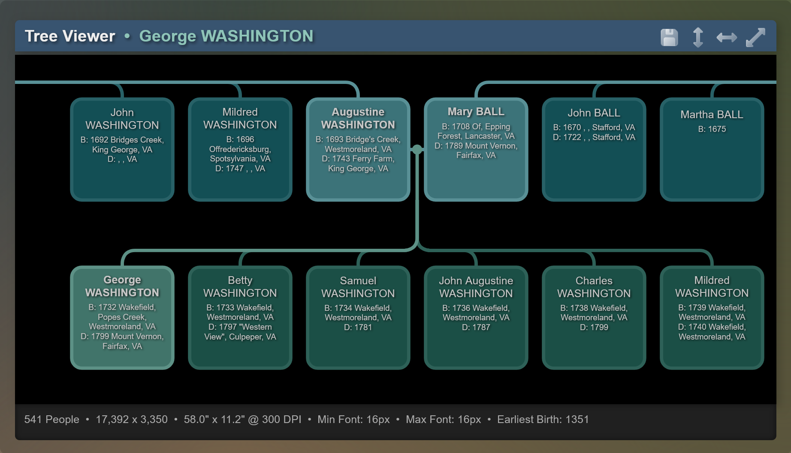

| Option | Description |
| ------ | ----------- |
|  | Click this button to save the tree as a PNG or SVG. Only the visible part of the tree is saved. If you zoom in before clicking the list you will only save part of the tree. If the tree is too large to save as a PNG, it will be resized and saved at a smaller size. SVGs have no size limits. |
|  | Click the vertical resize icon to fit the tree to the height of the viewer. |
|  | Click the horizontal resize icon to fit the tree to the width of the viewer. |
|  | Click the resize icon to fit the tree to the viewer. |
| Zoom | Zoom in on the tree as you would when using a mapping application like Google Maps (double-click, pinch, + key, - key, Esc key). |
| Pan | Pan around a zoomed-in tree as you would when using a mapping application like Google Maps (click and drag, arrow keys). |

## Attributions
Two 3rd party Javascript libraries are used by this application.
- [D3.js](https://d3js.org/)
- [canvas-size](https://github.com/jhildenbiddle/canvas-size)

The page background came from this excellent source:
- [Free SVG Backgrounds and Patterns by SVGBackgrounds.com](https://www.svgbackgrounds.com/set/free-svg-backgrounds-and-patterns/)

The icons are from icons8 > [liquid glass](https://icons8.com/icons/all--style-liquid-glass).

 

 

 

 

## Similar Repositories
Here are some similar repositories, however none of them seem to allow viewing a complete family tree.
- https://github.com/donatso/family-chart
- https://github.com/PeWu/topola-viewer
- https://github.com/khashashin/gedcom-viewer
