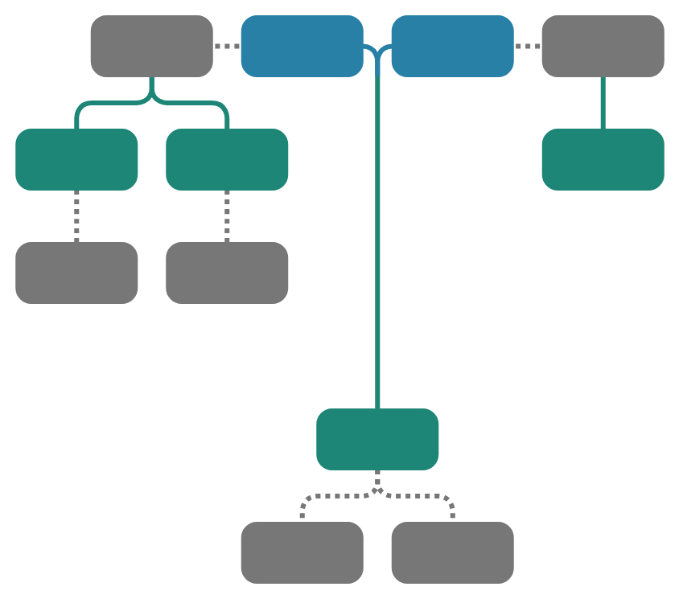

# Complete Family Tree Viewer

## About

The **Complete Family Tree Viewer** is a one-page application that allows users to load a family tree from a Gedcom file, then view the complete family tree for any person in that tree. This includes every one of the selected person's biological relatives and all of those relatives' spouses. It comes with numerous configuration options to control what people and information is displayed in the tree and how the tree is styled.

### A Few Examples
| Root&nbsp;Person | People&nbsp;Shown | Family&nbsp;Tree |
|:----------------:|:-----------------:|:----------------:|
| John&nbsp;Fitzgerald&nbsp;Kennedy | 145 People |  |
| Bart&nbsp;Simpson                 | 10 People  |  |
| Johann&nbsp;Sebastian&nbsp;Bach   | 32 People  |  |
| Me                              | 4,123 People |  |

### Demo
If you would like to try out this application without downloading the code for yourself, it is available on my personal website: [Complete Family Tree Viewer](https://www.erikshelley.com/complete-family-tree-viewer). 

### Data Privacy
When you use this program, your genealogy information is not uploaded anywhere. All processing is down in your browser. Feel free to review the code to confirm. In fact, after loading the page (and before selecting your Gedcom file), you can disconnect your computer from the internet and the application will continue to work.

If you don't have a Gedcom file of your own, download one of these [Gedcom sample files](https://github.com/D-Jeffrey/gedcom-samples) to use.

### Dependencies
Two 3rd party Javascript libraries are used by this application.
- [D3.js](https://d3js.org/)
- [canvas-size](https://github.com/jhildenbiddle/canvas-size)

### Questions, Issues, Feature Requests
Feel free to ask questions, report issues, or request new features right here on Github. Click on "Issues" above, make sure there is not already an existing issue that covers your topic, then create an issue.

## Design
The table below describes how various relationships are depicted in the family trees.

| Relationship | Description | Example |
| ------------ | ----------- |:-------:|
| Ancestors | Ancestors are shown above their children with the father on the left and the mother on the right. This is similar to how other family tree programs work. Each generation is a different color. |  |
| Spouses | Spouses who are ancestors are covered above. Spouses who are inlaws (not biologically related to the root of the tree) are shown in grey and connected to their spouse using a grey dotted line. If they are the spouse of an ancestor, they are displayed to the side of the ancestor. This is similar to how other family tree programs work. If they are not the spouse of an ancestor, they are displayed below their spouse. This is different from how other programs work and is done to save horizontal space and make large trees easier to view since they tend to become very wide. |  |
| Descendants | Descendants (children & siblings) whose parents are ancestors must by definition have a sibling who is also an ancestor or a sibling who is the root person. They are placed next to that sibling. Descendants who have a parent who is an inlaw are shown below that parent. Each generation is a different color. |  |
| Inbreeding | Sometimes people who are related have children together. In this case they have common ancestors. Rather than show the common ancestors twice, a dashed line is used to connect one of the people to their common ancestors. In the example to the right, the root person's parents are first cousins. Their father's father and their mother's father are brothers. |  |

The table below describes two key design concepts that make it possible to display very large and complete family trees.

| Layout | Description | Example |
| ------ | ----------- |:-------:|
| Levels | To avoid having lines that cross, the concept of levels is introduced. Each ancestor is at the top of a level with the root person being on the bottom level (level 1). All of the descendants of the ancestor's siblings and all of thte descendants of the ancestor's inlaw spouses must fit in that level and not cross into the level below.  While this prevents crossing lines, it means not all people in the same generation are on the same level. To help with this problem each generation is given a color.  In the example to the right, the root person and all people shaded green are in the same generation. Their relationships to root are as follows: - Level 1: siblings - Level 2: 1st cousins / half siblings - Level 3: 2nd cousins / half 1st cousins - Level 4: 3rd cousins / half 2nd cousins|  |
| Stacking | To avoid trees that are extremely wide, the concept of stacking is introduced. A person is defined as a leaf node if they have no inlaw spouses and no children. Leaf nodes can be arranged in a column rather than being side-by-side. In the example to the right, notice how both siblings and spouses can be stacked. This program allows the user to control the maximum stack size. A size of one means no stacking. |  |

## Usage

### Tree Content

| Option | Description |
| ------ | ----------- |
| Browse | Click the Browse button to select and load a Gedcom file from your computer. The people in thte Gedcom file will be populated in the list below. |
| Filter | Type a name in this box to filter the list of people. |
| Select Root Person | Click on a person to make the root of the tree. Their family tree will be drawn. |
| Generations Up | Change this value to control how many generations above the root person will be displayed. |
| Generations Up [MAX] | Click this link to automatically select and display the maximum number of generations available above the root person. |
| Generations Down | Change this value to control how many generations below the root person will be displayed. |
| Generations Down [MAX] | Click this link to automatically select and display the maximum number of generations available below the root person. |
| Maximum Stack Size | Change this value to control how many leaf nodes can be stacked in a single stack.|
| Maximum Stack Size [MAX] | Click this link to automatically select and display the maximum stack size. |
| Hide Childless Inlaws | Click this checkbox to hide inlaws who are leaf nodes. |

## Tree Styling

| Option | Description |
| ------ | ----------- |
| Use Defaults | Click this button to reset all options in the Tree Styling section to their default value. |
| Node Width | Change this value to control the width of the nodes. |
| Node Width [AUTO] | Click this link to automatically select and display the node width needed for the text to fit without needing a smaller font size. |
| Node Height | Change this value to control thet height of the nodes. |
| Node Height [AUTO] | Click this link to automatically select and display the node height needed for the text to fit. |
| X Spacing | Change this value to control the horizontal space between nodes. |
| Y Spacing | Change this value to control the vertical space between nodes. |
| Node Rounding % | Change this value to control how rounded the corners of the nodes are. |
| Show Names | Click this checkbox to show people's names in the tree. |
| Show Years of BirthDeath | Click this checkbox to show people's years of birth and death in the tree. |
| Show Places of BirthDeath | Click this checkbox to show people's places of birth and death in the tree. |
| Node Border Width | Change this value to control the size of the node borders. |
| Node Border Highlight | Change this value to control if the node borders are darker or brighter than the nodes. 0% is black, 100% is the same brightness as the nodes, and 200% is twice as bright as the nodes. |
| Node Border Highlight [NONE] | Click this link to make the node borders the same brightness as the nodes, effectively making them invisible. |
| Link Thickness | Change this value to control how thick the links are between nodes. |
| Link Rounding % | Change this value to control how rounded the link paths between nodes are. |
| Text Size | Change this value to control the size of the text in the nodes. |
| Text Brightness | Change this value to control how bright the tetxt is in the nodes. |
| Text Shadows | Click this checkbox to enable text shadows. |
| Hue Root | Change this value to control the hue used for the color of the root generation. |
| Saturation | Change this value to control how saturated the colors of the nodes are. |
| Luminance | Change this value to control how bright the colors of the nodes are. |
| Pedigree Highlight | Change this value to control if thte pedigree nodes (direct ancestors and descendants of the root person) are darker or brighter than everyone else. 0% is black, 100% is the same brightness as everyone else, and 200% is twice as bright as everyone else. |
| Pedigree Highlight [NONE] | Click this link to make the pedigree nodes the same brightness as everyone else. |
| Transparent Background | Click this checkbox to use a transparent background for the tree. |
| Background Color | Click this control to choose a background color. The color will only be used if the Transparent Background checkbox is not checked. |

## Tree Viewer

| Option | Description |
| ------ | ----------- |
| Save PNG | Click this button to save the tree as a PNG. Only the visible part of the tree is saved. If you zoom in before clicking the list you will only save part of the tree. If the tree is too large to save as a PNG, it will be resized and saved at a smaller size. SVGs have no size limits. |
| Save SVG | Click this button to save thte tree as an SVG. Only the visible part of the tree is saved. If you zoom in before clicking the list you will only save part of the tree. SVGs effectively have an infinite resolution. |
| Zoom | Zoom in on the tree as you would when using a mapping application like Google Maps (double-click, pinch, etc.). |
| Pan | Pan around a zoomed-in tree as you would when using a mapping application like Google Maps (click and drag). |

