# Complete Family Tree Viewer

The **Complete Family Tree Viewer** is a one-page application that allows you to load a family tree from a Gedcom file, then view the complete family tree for any person in that tree. A "complete family tree" for a given person is one that includes every one of their biological relatives and all of those relatives' spouses (in-laws).

This application comes with numerous configuration options to control which people and what information is displayed in the tree, as well as how the tree is styled. If you don't have a Gedcom file available, you can download one of these [Gedcom sample files](https://github.com/D-Jeffrey/gedcom-samples) to use.

This application **does not** allow you to create or edit family trees. For that, you need to use some other genealogy applications or website that allows you to export your tree as a Gedcom file. Here are some of the most popular options:
- Websites: [Ancestry](https://www.ancestry.com/), [MyHeritage](https://www.myheritage.com/), [Family Search](https://www.familysearch.org/) 
- Desktop Software: [RootsMagic](https://www.rootsmagic.com/), [Gramps](https://www.gramps-project.org/wiki/index.php/Main_page), [Legacy Family Tree](https://legacyfamilytree.com/), [GenoPro](https://genopro.com/), [Family Tree Maker](https://www.mackiev.com/ftm/)

## Installation Instructions
Either clone the respository or download and extract the zip file, then open index.html in a browser. A working copy is available to use on-line on my personal website.

### Try it out here: [Complete Family Tree Viewer](https://www.erikshelley.com/complete-family-tree-viewer) 

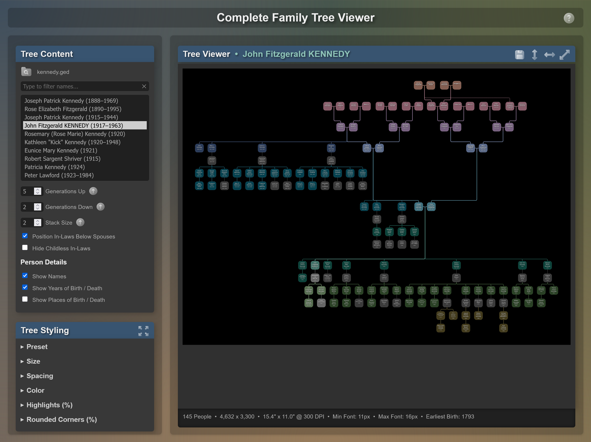

## Examples
Here are a few examples trees to demonstrate some of the program's capabilities:

| Root&nbsp;Person | People&nbsp;Shown | Family&nbsp;Tree |
|:----------------:|:-----------------:|:----------------:|
| John&nbsp;Fitzgerald&nbsp;Kennedy | 145 People | 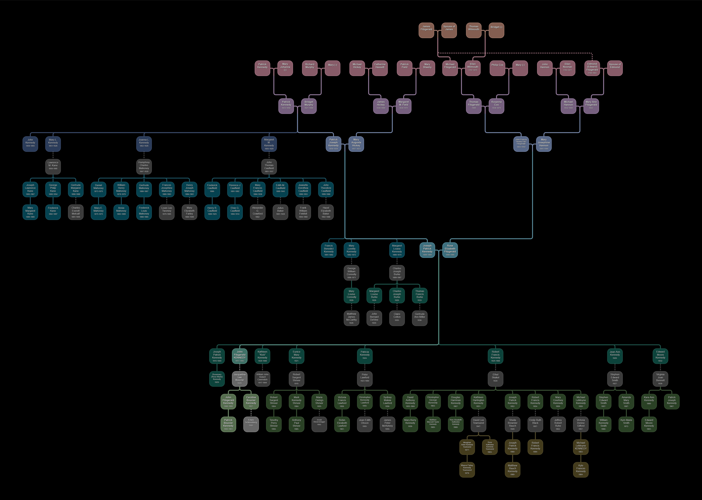 |
| Bart&nbsp;Simpson                 | 10 People  | 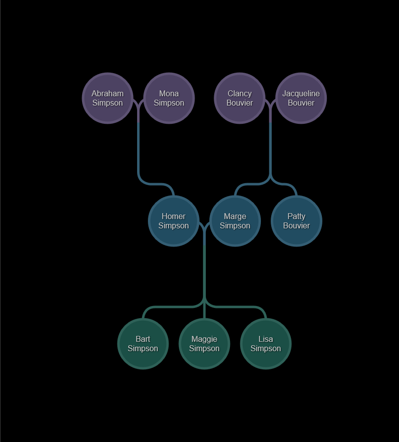 |
| Johann&nbsp;Sebastian&nbsp;Bach   | 32 People  | 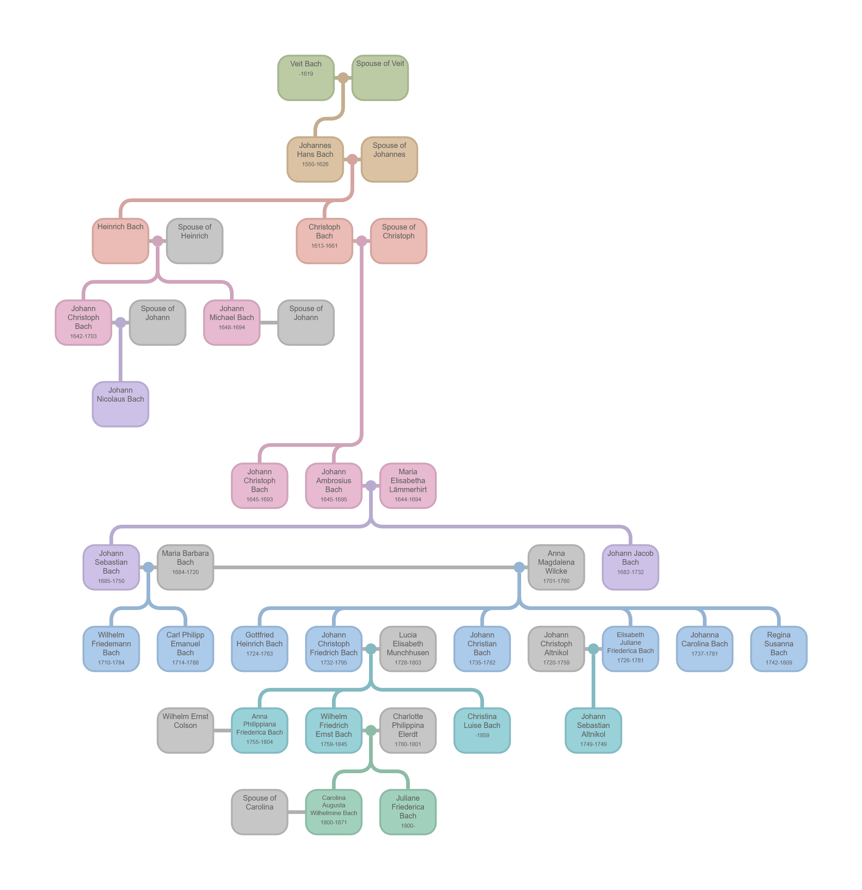 |
| Me                              | 4,798 People |  |

### Data Privacy
When you use this program, your genealogy information is not uploaded anywhere. All processing is down in your browser. Feel free to review the code to confirm. In fact, after loading the page (and before selecting your Gedcom file), you can disconnect your computer from the internet and the application will continue to work.

### Dependencies
Two 3rd party Javascript libraries are used by this application.
- [D3.js](https://d3js.org/)
- [canvas-size](https://github.com/jhildenbiddle/canvas-size)

The page background came from this excellent source:
- [Free SVG Backgrounds and Patterns by SVGBackgrounds.com](https://www.svgbackgrounds.com/set/free-svg-backgrounds-and-patterns/)

The icons are from icons8 > [liquid glass](https://icons8.com/icons/all--style-liquid-glass).
-  <a target="_blank" href="https://icons8.com/icon/0mAtpPoNoAEd/menu">Menu</a> icon by <a target="_blank" href="https://icons8.com">Icons8</a>
-  <a target="_blank" href="https://icons8.com/icon/osnYseY0Xola/help">Help</a> icon by <a target="_blank" href="https://icons8.com">Icons8</a>
-  <a target="_blank" href="https://icons8.com/icon/lSqvuA59KBiX/browse-folder">Browse Folder</a> icon by <a target="_blank" href="https://icons8.com">Icons8</a>
-  <a target="_blank" href="https://icons8.com/icon/Kxg3ddPq2XL6/upward-arrow">Top</a> icon by <a target="_blank" href="https://icons8.com">Icons8</a>
-  <a target="_blank" href="https://icons8.com/icon/1jinb9WZokXK/expand">Expand</a> icon by <a target="_blank" href="https://icons8.com">Icons8</a>
-  <a target="_blank" href="https://icons8.com/icon/oXQVibFkysZg/collapse">Collapse</a> icon by <a target="_blank" href="https://icons8.com">Icons8</a>
-  <a target="_blank" href="https://icons8.com/icon/PjMvq8ClC94p/resize">Resize</a> icon by <a target="_blank" href="https://icons8.com">Icons8</a>
-  <a target="_blank" href="https://icons8.com/icon/DXECg4JU1n2x/cancel">Cancel</a> icon by <a target="_blank" href="https://icons8.com">Icons8</a>
-  <a target="_blank" href="https://icons8.com/icon/3VO7xUNfMILv/save">Save</a> icon by <a target="_blank" href="https://icons8.com">Icons8</a>
-  <a target="_blank" href="https://icons8.com/icon/GiGSyDPA8118/resize-vertical">Resize Vertical</a> icon by <a target="_blank" href="https://icons8.com">Icons8</a>
-  <a target="_blank" href="https://icons8.com/icon/GXzkVzhz4pZm/resize-horizontal">Resize Horizontal</a> icon by <a target="_blank" href="https://icons8.com">Icons8</a>
-  <a target="_blank" href="https://icons8.com/icon/bcZmJfs5prDE/enlarge">Enlarge</a> icon by <a target="_blank" href="https://icons8.com">Icons8</a>

### Questions, Issues, Feature Requests
Feel free to ask questions, report issues, or request new features right [here on Github](https://github.com/erikshelley/complete-family-tree-viewer/issues)! Review the existing issues first to avoid creating a duplicate.

## Design
The table below describes how various relationships are depicted in the family trees.

| Relationship | Description | Example |
| ------------ | ----------- |:-------:|
| Ancestors | Ancestors are shown above their children with the father on the left and the mother on the right. This is similar to how other family tree programs work. Each generation is a different color. | 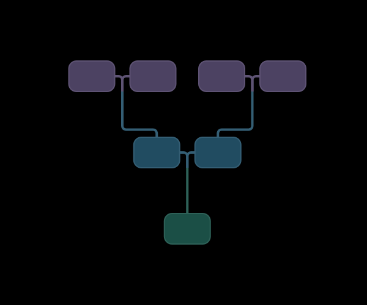 |
| In-Laws | In-laws are shown in grey and connected to their spouse using a grey line. If they are the spouse of an ancestor, they are displayed to the side of the ancestor. If they are not the spouse of an ancestor, they can be placed either next to or below their spouse. Placing them below can save horizontal space and make large trees easier to view. | In-Laws beside their spouses: 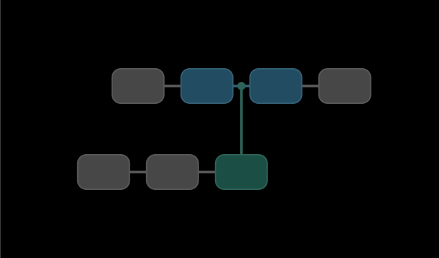 In-laws below their spouses: 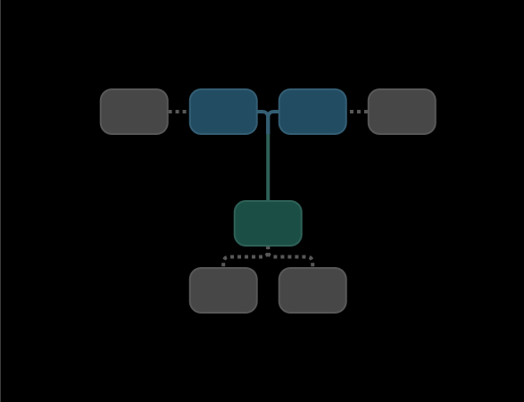 |
| Descendants | Descendants (children & siblings) are placed below their parents. The placement depends on whether the in-laws are beside or below their spouses. | In-laws beside their spouses: 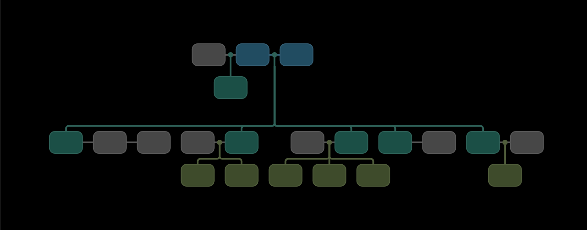 In-laws below their spouses: 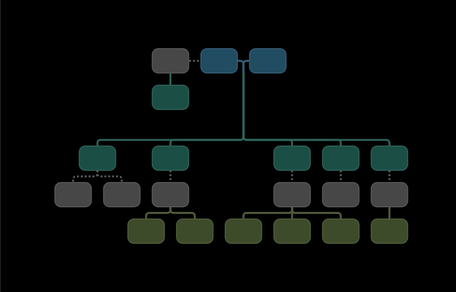 |
| Inbreeding | Sometimes people who are related have children together. In this case they have common ancestors. Rather than show the common ancestors twice, a dashed line is used to connect one of the people to their common ancestors. In the example to the right, the root person's parents are first cousins. Their father's father and their mother's father are brothers. | 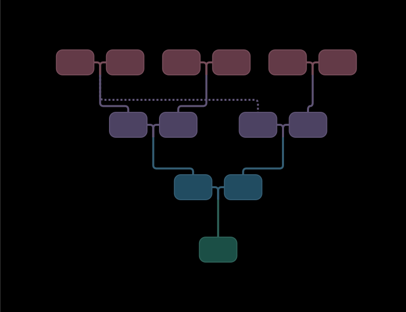 |

### Levels

To avoid having lines that cross, the concept of levels is introduced. Each generation of ancestors is at the top of a level with the root person being on the bottom level (level 1). All of the descendants of the ancestor's siblings and all of thte descendants of the ancestor's in-law spouses must fit in that level and not cross into the level below.

While this prevents crossing lines, it means not all people in the same generation are on the same level. To help with this problem each generation is given a color.

In the example below, the root person and all people shaded green are in the same generation. Their relationships to root are as follows:
- Level 1: siblings
- Level 2: 1st cousins / half siblings
- Level 3: 2nd cousins / half 1st cousins

### Stacking

To avoid trees that are extremely wide, the concept of stacking is introduced. A person is defined as a leaf node if they have no in-law spouses and no children. Leaf nodes can be arranged in a column rather than being side-by-side. In the example to the right, notice how both siblings and spouses can be stacked. This program allows you to control the maximum stack size. A size of one means no stacking.

The example below contains the same people as the previous example in the **levels** section above. It takes up significantly less space.

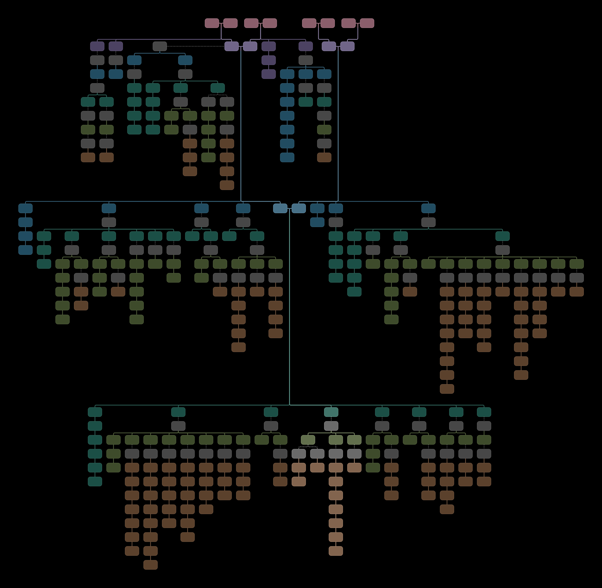

## Usage

### Tree Content
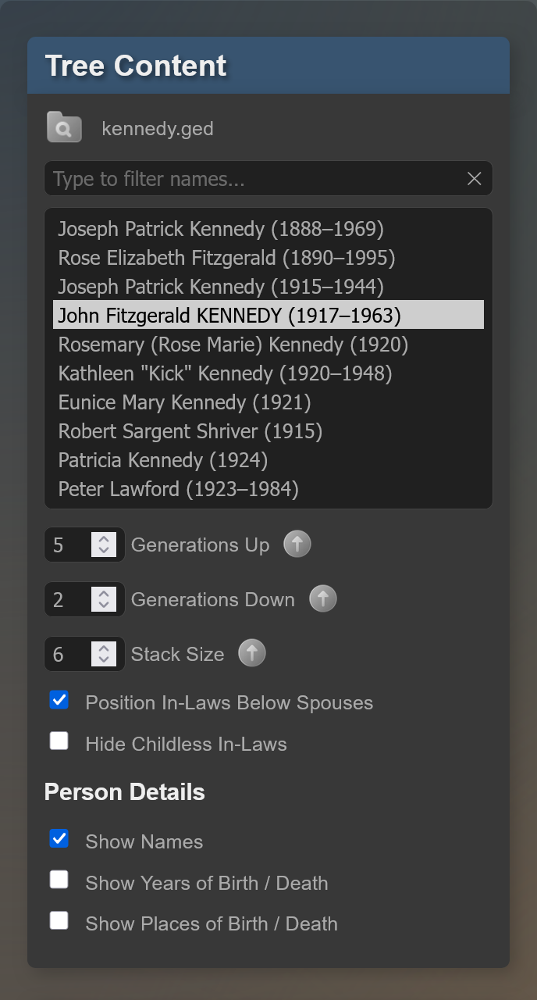

| Option | Description |
| ------ | ----------- |
|  | Click the Browse button to select and load a Gedcom file from your computer. The people in thte Gedcom file will be populated in the list below. |
| Filter | Type a name in this box to filter the list of people. |
| Select Root Person | Click on a person to make the root of the tree. Their family tree will be drawn. |
| Generations Up | Change this value to control how many generations above the root person will be displayed. Click the up arrow  to use the maximum possible value for the root person. |
| Generations Down | Change this value to control how many generations below the root person will be displayed. Click the up arrow  to use the maximum possible value for the root person. |
| Stack Size | Change this value to control how many leaf nodes can be stacked in a single stack. Click the up arrow  to use the maximum possible value for the root person. |
| Position In-Laws Below Spouses | Click this checkbox to position in-laws below their spouses. If it is unchecked, they will be beside their spouses. |
| Hide Childless In-Laws | Click this checkbox to hide in-laws who are leaf nodes. |

### Person Details
| Option | Description |
| ------ | ----------- |
| Show Names | Click this checkbox to show people's names in the tree. |
| Show Years of Birth / Death | Click this checkbox to show people's years of birth and death in the tree. |
| Show Places of Birth / Death | Click this checkbox to show people's places of birth and death in the tree. |

## Tree Styling
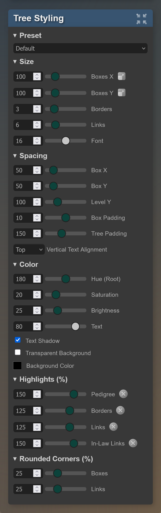

### Overall
| Option | Description |
| ------ | ----------- |
|  | Expand all tree styling sections. |
|  | Collapse all tree styling sections. |
| Presets | Select a preset to quickly change a number of the style settings. Some tree content settings may be changed as well. |

### Size
| Option | Description |
| ------ | ----------- |
| Boxes X | Change this value to control the width of the nodes. Click the resize icon  to use the width needed to fit the text. |
| Boxes Y | Change this value to control thet height of the nodes. Click the resize icon  to use thhe height needed to fit the text. |
| Borders | Change this value to control the size of the node borders. |
| Links | Change this value to control how thick the links are between nodes. |
| Font | Change this value to control the size of the text in the nodes. |

### Spacing
| Option | Description |
| ------ | ----------- |
| Boxes X | Change this value to control the horizontal space between nodes. |
| Boxes Y | Change this value to control the vertical space between nodes. |
| Levels Y | Change this value to control the vertical space between levels. |
| Tree Padding | Change this value to control the padding around the tree. |

### Color
| Option | Description |
| ------ | ----------- |
| Hue Root | Change this value to control the hue used for the color of the root generation. |
| Saturation | Change this value to control how saturated the colors of the nodes are. |
| Brightness | Change this value to control the brightness of the tree nodes and links. |
| Text | Change this value to control how bright the text is in the nodes. |
| Text Shadow | Click this checkbox to enable text shadows. |
| Transparent Background | Click this checkbox to use a transparent background for the tree. |
| Background Color | Click this control to choose a background color. The color will only be used if the Transparent Background checkbox is not checked. |

### Highlights (%)
| Option | Description |
| ------ | ----------- |
| Pedigree | Change this value to control if thte pedigree nodes (direct ancestors and descendants of the root person) are darker or brighter than everyone else. 0% is black, 100% is the same brightness as everyone else, and 200% is twice as bright as everyone else. Click the X icon  to use 100% for no highlighting. |
| Borders | Change this value to control if the node borders are darker or brighter than the nodes. 0% is black, 100% is the same brightness as the nodes, and 200% is twice as bright as the nodes. Click the X icon  to use 100% for no highlighting. |
| Links | Change this value to control if the links are darker or brighter than the nodes. 0% is black, 100% is the same brightness as the nodes, and 200% is twice as bright as the nodes. Click the X icon  to use 100% for no highlighting. |
| In-Law Links | Change this value to control if the in-law links are darker or brighter than the nodes. 0% is black, 100% is the same brightness as the nodes, and 200% is twice as bright as the nodes. Click the X icon  to use 100% for no highlighting. |

### Rounded Corners
| Option | Description |
| ------ | ----------- |
| Rounding % | Change this value to control how rounded the corners of the nodes are. |
| Rounding % | Change this value to control how rounded the link paths between nodes are. |

## Tree Viewer

| Option | Description |
| ------ | ----------- |
|  | Click this button to save the tree as a PNG or SVG. Only the visible part of the tree is saved. If you zoom in before clicking the list you will only save part of the tree. If the tree is too large to save as a PNG, it will be resized and saved at a smaller size. SVGs have no size limits. |
|  | Click the vertical resize icon to fit the tree to the height of the viewer. |
|  | Click the horizontal resize icon to fit the tree to the width of the viewer. |
|  | Click the resize icon to fit the tree to the viewer. |
| Zoom | Zoom in on the tree as you would when using a mapping application like Google Maps (double-click, pinch, + key, - key, Esc key). |
| Pan | Pan around a zoomed-in tree as you would when using a mapping application like Google Maps (click and drag, arrow keys). |

