# Mermaid Diagram Samples

Diagram types confirmed stable on both GitHub and VS Code.

---

## Flowchart

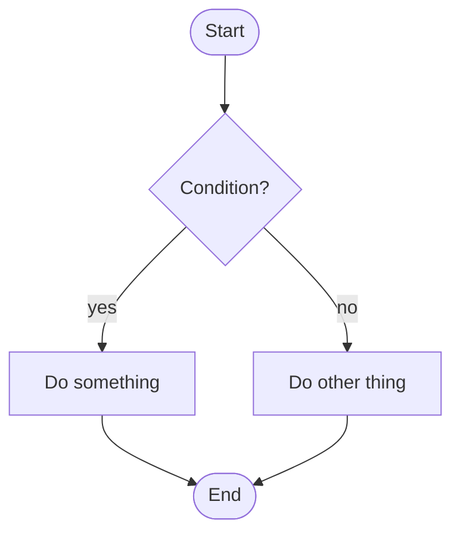

---

## Sequence Diagram

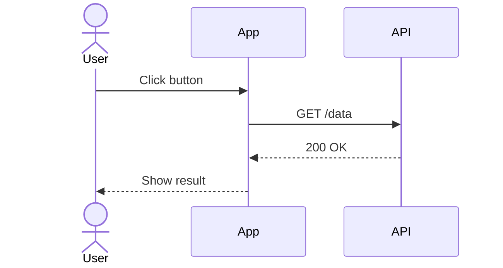

---

## Class Diagram

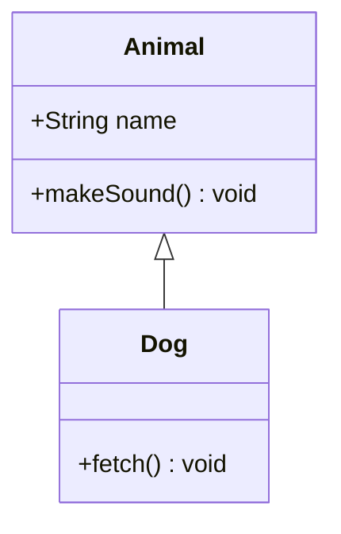

---

## State Diagram

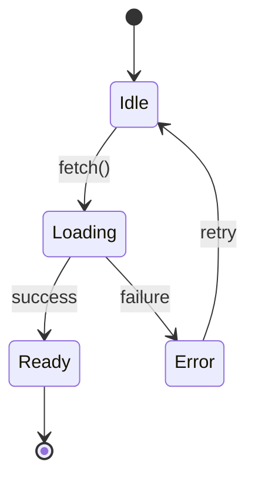

---

## Entity Relationship Diagram

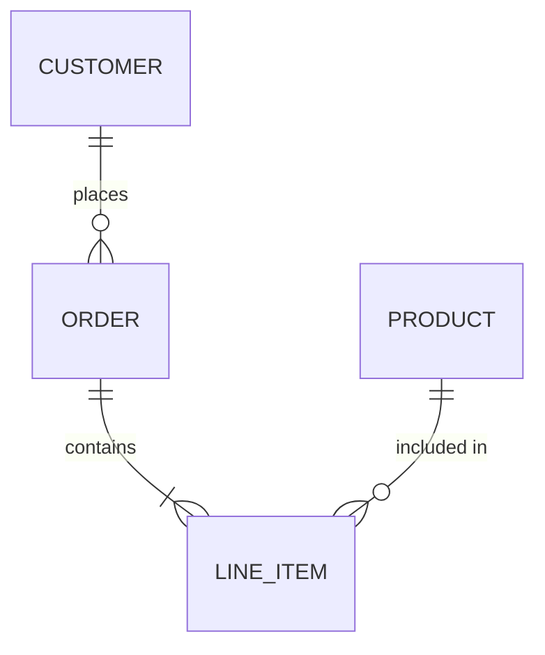

---

## User Journey

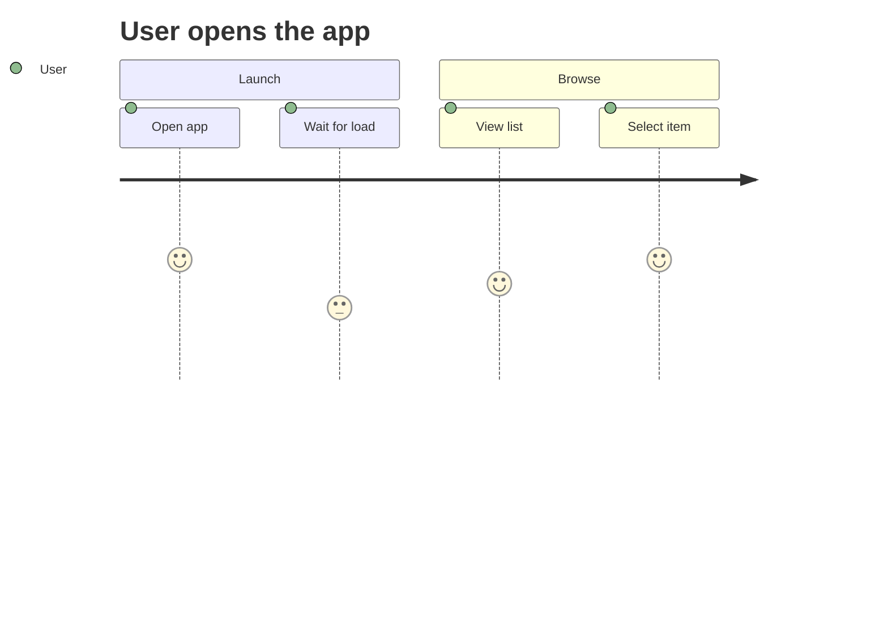

---

## Gantt

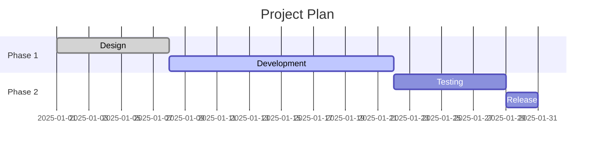

---

## Pie Chart

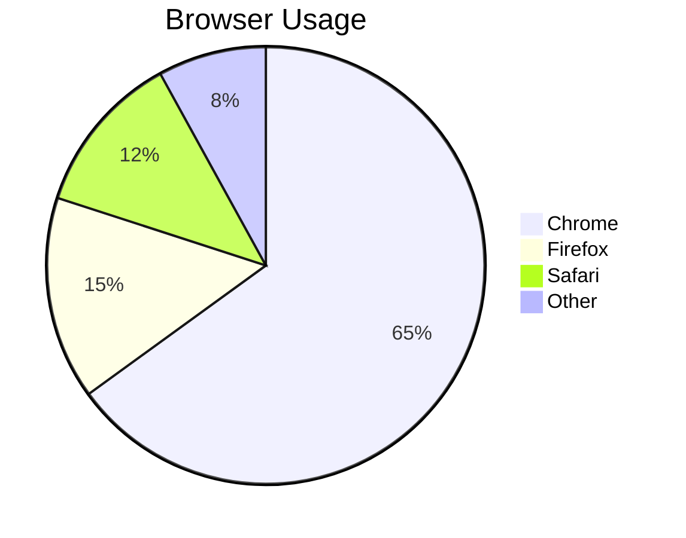

---

## Requirement Diagram

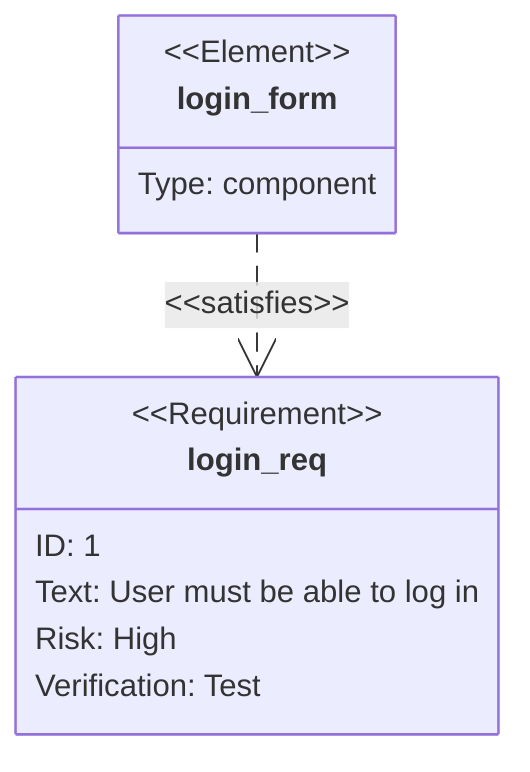

---

## Git Graph

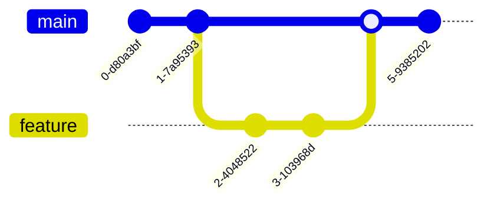

---

## Mindmap

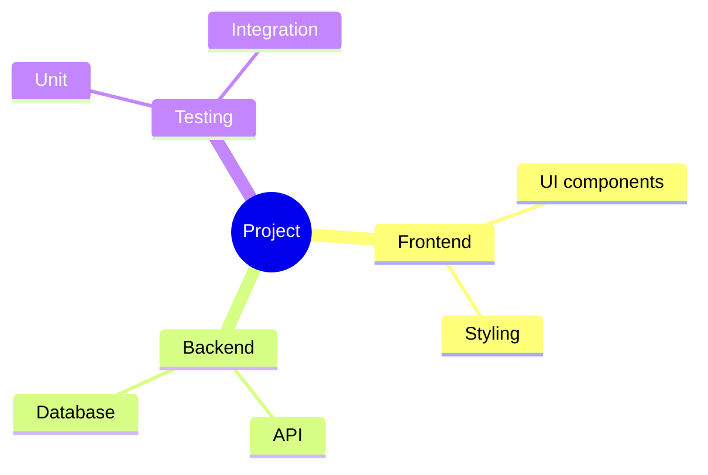

---

## Timeline

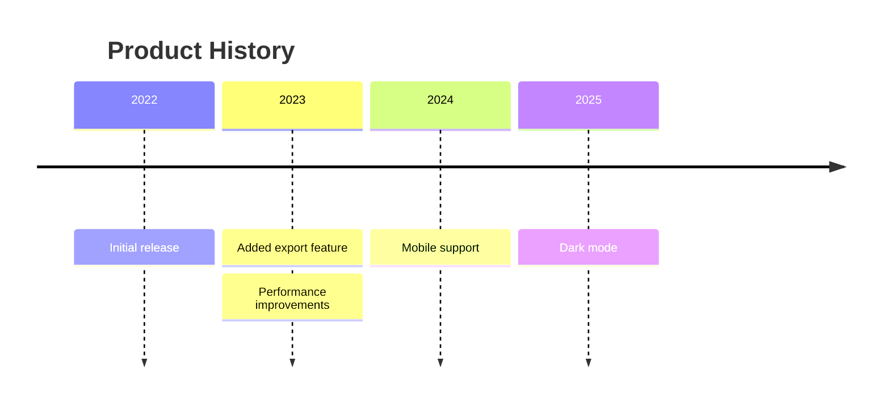

---

## Quadrant Chart

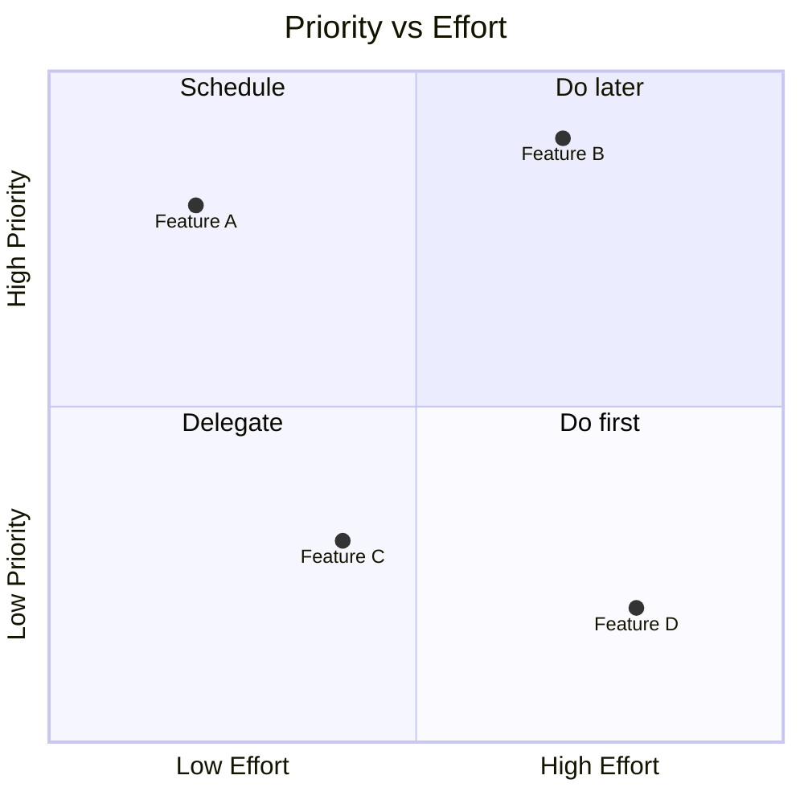
