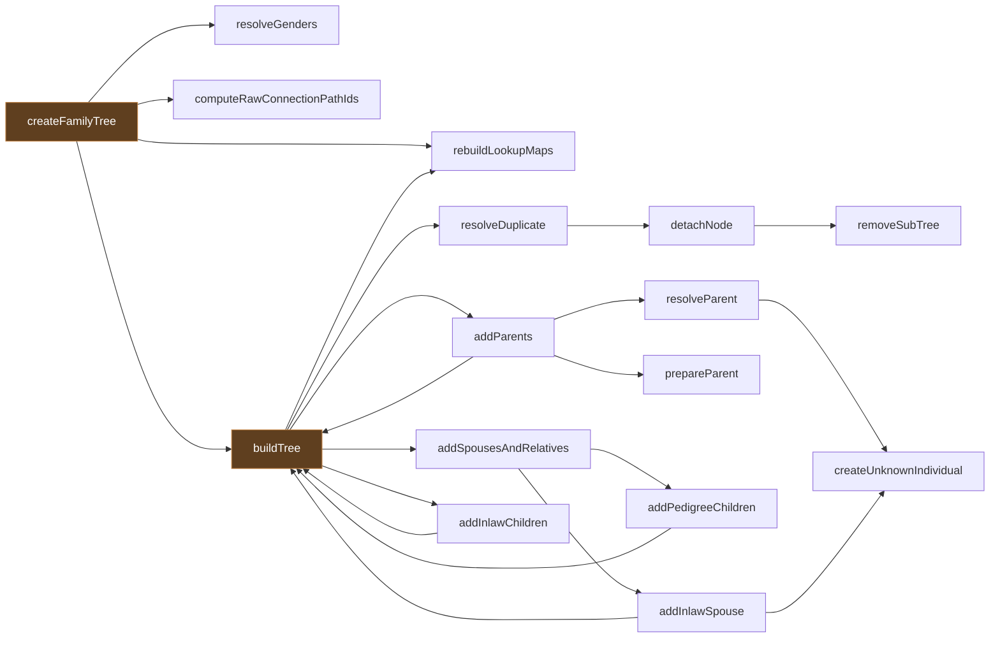
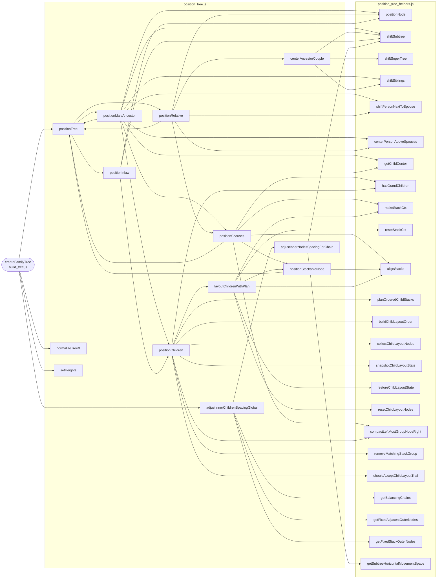
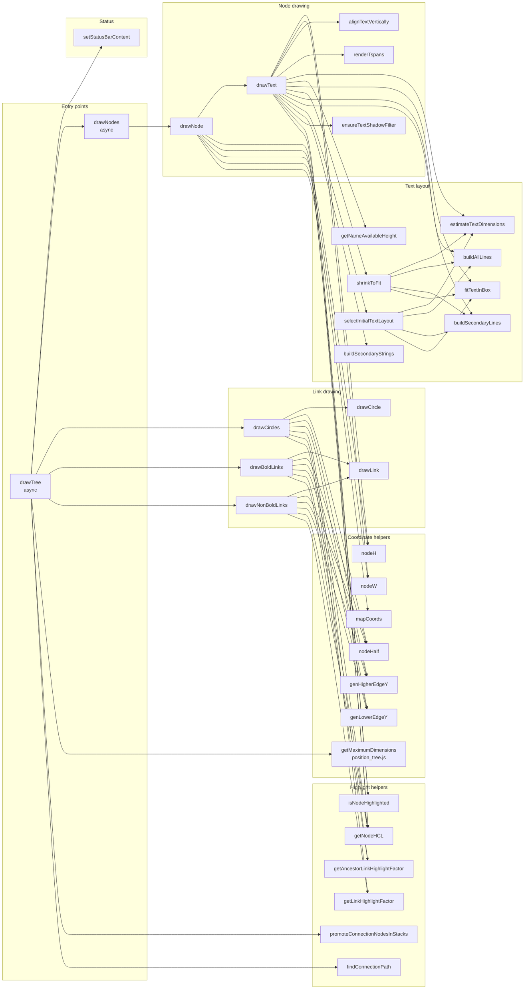
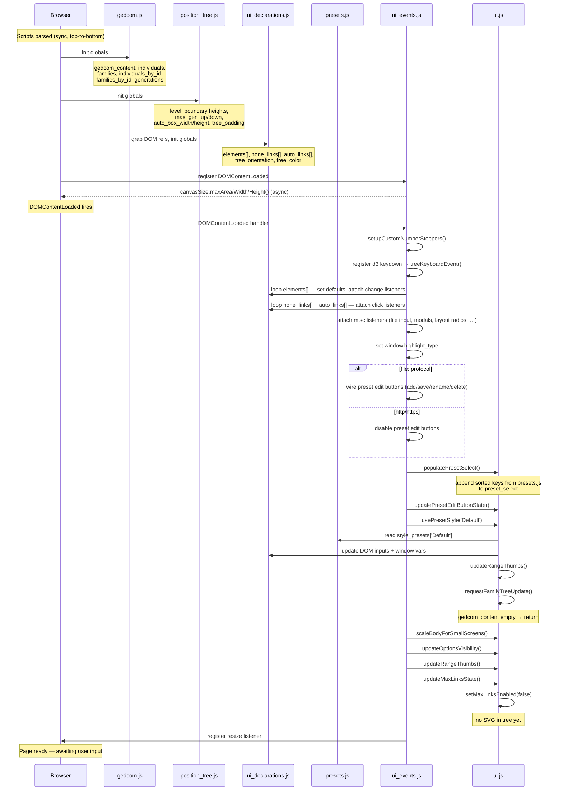
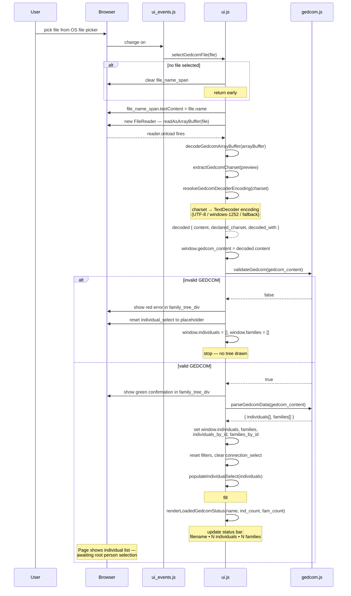

# Code Flow Diagrams

## Build Tree

```mermaid
flowchart LR
    createFamilyTree --> rebuildLookupMaps
    createFamilyTree --> resolveGenders
    createFamilyTree --> computeRawConnectionPathIds
    createFamilyTree --> buildTree

    buildTree --> rebuildLookupMaps
    buildTree --> resolveDuplicate
    buildTree --> addParents
    buildTree --> addSpousesAndRelatives
    buildTree --> addInlawChildren

    resolveDuplicate --> detachNode
    detachNode --> removeSubTree

    addParents --> resolveParent
    addParents --> prepareParent
    addParents --> buildTree

    resolveParent --> createUnknownIndividual

    addSpousesAndRelatives --> addPedigreeChildren
    addSpousesAndRelatives --> addInlawSpouse

    addPedigreeChildren --> buildTree

    addInlawSpouse --> createUnknownIndividual
    addInlawSpouse --> buildTree

    addInlawChildren --> buildTree

    classDef one fill:#5f3f1f,stroke:#bf7f3f,color:#fff
    class createFamilyTree,buildTree one
```

## Position Tree

```mermaid
flowchart LR
    subgraph pt["position_tree.js"]
        positionTree
        positionMaleAncestor
        positionRelative
        centerAncestorCouple
        positionInlaw
        positionSpouses
        positionChildren
        positionStackableNode
        layoutChildrenWithPlan
        adjustInnerChildrenSpacingGlobal
        adjustInnerNodesSpacingForChain
        normalizeTreeX
        setHeights
    end

    subgraph ph["position_tree_helpers.js"]
        positionNode
        shiftSubtree
        shiftSuperTree
        shiftSiblings
        shiftPersonNextToSpouse
        centerPersonAboveSpouses
        getChildCenter
        hasGrandChildren
        makeStackCtx
        resetStackCtx
        alignStacks
        planOrderedChildStacks
        buildChildLayoutOrder
        collectChildLayoutNodes
        snapshotChildLayoutState
        restoreChildLayoutState
        resetChildLayoutNodes
        compactLeftMostGroupNodeRight
        removeMatchingStackGroup
        shouldAcceptChildLayoutTrial
        getBalancingChains
        getFixedAdjacentOuterNodes
        getFixedStackOuterNodes
        getSubtreeHorizontalMovementSpace
    end

    createFamilyTree(["createFamilyTree
    build_tree.js"]) --> positionTree
    createFamilyTree --> normalizeTreeX
    createFamilyTree --> setHeights
    createFamilyTree --> adjustInnerChildrenSpacingGlobal

    positionTree --> positionMaleAncestor
    positionTree --> positionRelative
    positionTree --> positionInlaw

    positionMaleAncestor --> positionTree
    positionMaleAncestor --> positionNode
    positionMaleAncestor --> positionSpouses
    positionMaleAncestor --> positionChildren
    positionMaleAncestor --> shiftPersonNextToSpouse
    positionMaleAncestor --> centerPersonAboveSpouses
    positionMaleAncestor --> shiftSubtree
    positionMaleAncestor --> shiftSiblings
    positionMaleAncestor --> getChildCenter

    positionRelative --> positionNode
    positionRelative --> positionSpouses
    positionRelative --> shiftPersonNextToSpouse
    positionRelative --> centerPersonAboveSpouses
    positionRelative --> positionTree
    positionRelative --> centerAncestorCouple

    centerAncestorCouple --> shiftSubtree
    centerAncestorCouple --> shiftSiblings
    centerAncestorCouple --> shiftSuperTree

    positionInlaw --> positionNode
    positionInlaw --> positionChildren
    positionInlaw --> shiftSubtree
    positionInlaw --> getChildCenter

    positionSpouses --> hasGrandChildren
    positionSpouses --> makeStackCtx
    positionSpouses --> positionStackableNode
    positionSpouses --> alignStacks
    positionSpouses --> positionTree
    positionSpouses --> compactLeftMostGroupNodeRight

    positionChildren --> hasGrandChildren
    positionChildren --> collectChildLayoutNodes
    positionChildren --> snapshotChildLayoutState
    positionChildren --> planOrderedChildStacks
    positionChildren --> layoutChildrenWithPlan
    positionChildren --> removeMatchingStackGroup
    positionChildren --> buildChildLayoutOrder
    positionChildren --> shouldAcceptChildLayoutTrial
    positionChildren --> compactLeftMostGroupNodeRight

    positionStackableNode --> positionTree
    positionStackableNode --> alignStacks

    layoutChildrenWithPlan --> resetChildLayoutNodes
    layoutChildrenWithPlan --> restoreChildLayoutState
    layoutChildrenWithPlan --> makeStackCtx
    layoutChildrenWithPlan --> resetStackCtx
    layoutChildrenWithPlan --> alignStacks
    layoutChildrenWithPlan --> positionStackableNode

    adjustInnerChildrenSpacingGlobal --> getBalancingChains
    adjustInnerChildrenSpacingGlobal --> getFixedAdjacentOuterNodes
    adjustInnerChildrenSpacingGlobal --> getFixedStackOuterNodes
    adjustInnerChildrenSpacingGlobal --> adjustInnerNodesSpacingForChain

    adjustInnerNodesSpacingForChain --> getSubtreeHorizontalMovementSpace
    adjustInnerNodesSpacingForChain --> shiftSubtree
```

## Draw Tree

```mermaid
flowchart LR
    subgraph entry["Entry points"]
        drawTree["drawTree\nasync"]
        drawNodes["drawNodes\nasync"]
    end

    subgraph links["Link drawing"]
        drawNonBoldLinks
        drawBoldLinks
        drawCircles
        drawLink
        drawCircle
    end

    subgraph nodes["Node drawing"]
        drawNode
        drawText
        renderTspans
        alignTextVertically
        ensureTextShadowFilter
    end

    subgraph text["Text layout"]
        buildSecondaryStrings
        buildSecondaryLines
        buildAllLines
        selectInitialTextLayout
        shrinkToFit
        estimateTextDimensions
        fitTextInBox
        getNameAvailableHeight
    end

    subgraph highlight["Highlight helpers"]
        findConnectionPath
        promoteConnectionNodesInStacks
        getLinkHighlightFactor
        getAncestorLinkHighlightFactor
        isNodeHighlighted
        getNodeHCL
    end

    subgraph coords["Coordinate helpers"]
        mapCoords
        nodeW
        nodeH
        nodeHalf
        genLowerEdgeY
        genHigherEdgeY
        getMaximumDimensions["getMaximumDimensions\nposition_tree.js"]
    end

    subgraph status["Status"]
        setStatusBarContent
    end

    drawTree --> findConnectionPath
    drawTree --> promoteConnectionNodesInStacks
    drawTree --> getMaximumDimensions
    drawTree --> drawNonBoldLinks
    drawTree --> drawBoldLinks
    drawTree --> drawCircles
    drawTree --> drawNodes
    drawTree --> setStatusBarContent

    drawNonBoldLinks --> getLinkHighlightFactor
    drawNonBoldLinks --> getNodeHCL
    drawNonBoldLinks --> genLowerEdgeY
    drawNonBoldLinks --> genHigherEdgeY
    drawNonBoldLinks --> nodeHalf
    drawNonBoldLinks --> drawLink

    drawBoldLinks --> getAncestorLinkHighlightFactor
    drawBoldLinks --> getNodeHCL
    drawBoldLinks --> genLowerEdgeY
    drawBoldLinks --> genHigherEdgeY
    drawBoldLinks --> nodeHalf
    drawBoldLinks --> drawLink

    drawCircles --> getLinkHighlightFactor
    drawCircles --> getAncestorLinkHighlightFactor
    drawCircles --> getNodeHCL
    drawCircles --> genLowerEdgeY
    drawCircles --> genHigherEdgeY
    drawCircles --> nodeHalf
    drawCircles --> drawCircle

    drawNodes --> drawNode

    drawNode --> mapCoords
    drawNode --> nodeW
    drawNode --> nodeH
    drawNode --> isNodeHighlighted
    drawNode --> getNodeHCL
    drawNode --> drawText

    drawText --> isNodeHighlighted
    drawText --> getNodeHCL
    drawText --> ensureTextShadowFilter
    drawText --> buildSecondaryStrings
    drawText --> selectInitialTextLayout
    drawText --> buildSecondaryLines
    drawText --> buildAllLines
    drawText --> shrinkToFit
    drawText --> fitTextInBox
    drawText --> getNameAvailableHeight
    drawText --> estimateTextDimensions
    drawText --> renderTspans
    drawText --> alignTextVertically
    drawText --> nodeW
    drawText --> nodeH

    selectInitialTextLayout --> fitTextInBox
    selectInitialTextLayout --> buildSecondaryLines
    selectInitialTextLayout --> buildAllLines
    selectInitialTextLayout --> estimateTextDimensions

    shrinkToFit --> fitTextInBox
    shrinkToFit --> buildSecondaryLines
    shrinkToFit --> buildAllLines
    shrinkToFit --> estimateTextDimensions
```

## Open Page

```mermaid
sequenceDiagram
    participant Browser
    participant gedcom.js
    participant position_tree.js
    participant ui_declarations.js
    participant presets.js
    participant ui_events.js
    participant ui.js

    Note over Browser: Scripts parsed (sync, top-to-bottom)
    Browser->>gedcom.js: init globals
    Note over gedcom.js: gedcom_content, individuals,<br>families, individuals_by_id,<br>families_by_id, generations
    Browser->>position_tree.js: init globals
    Note over position_tree.js: level_boundary heights,<br>max_gen_up/down,<br>auto_box_width/height, tree_padding
    Browser->>ui_declarations.js: grab DOM refs, init globals
    Note over ui_declarations.js: elements[], none_links[], auto_links[],<br>tree_orientation, tree_color
    Browser->>ui_events.js: register DOMContentLoaded
    ui_events.js-->>Browser: canvasSize.maxArea/Width/Height() (async)

    Note over Browser: DOMContentLoaded fires
    Browser->>ui_events.js: DOMContentLoaded handler

    ui_events.js->>ui_events.js: setupCustomNumberSteppers()
    ui_events.js->>ui_events.js: register d3 keydown → treeKeyboardEvent()
    ui_events.js->>ui_declarations.js: loop elements[] — set defaults, attach change listeners
    ui_events.js->>ui_declarations.js: loop none_links[] + auto_links[] — attach click listeners
    ui_events.js->>ui_events.js: attach misc listeners (file input, modals, layout radios, …)
    ui_events.js->>ui_events.js: set window.highlight_type

    alt file: protocol
        ui_events.js->>ui_events.js: wire preset edit buttons (add/save/rename/delete)
    else http/https
        ui_events.js->>ui_events.js: disable preset edit buttons
    end

    ui_events.js->>ui.js: populatePresetSelect()
    Note over ui.js: append sorted keys from presets.js<br>to preset_select
    ui_events.js->>ui.js: updatePresetEditButtonState()
    ui_events.js->>ui.js: usePresetStyle('Default')
    ui.js->>presets.js: read style_presets['Default']
    ui.js->>ui_declarations.js: update DOM inputs + window vars
    ui.js->>ui.js: updateRangeThumbs()
    ui.js->>ui.js: requestFamilyTreeUpdate()
    Note over ui.js: gedcom_content empty → return

    ui_events.js->>ui.js: scaleBodyForSmallScreens()
    ui_events.js->>ui.js: updateOptionsVisibility()
    ui_events.js->>ui.js: updateRangeThumbs()
    ui_events.js->>ui.js: updateMaxLinksState()
    ui.js->>ui.js: setMaxLinksEnabled(false)
    Note over ui.js: no SVG in tree yet

    ui_events.js->>Browser: register resize listener
    Note over Browser: Page ready — awaiting user input
```

## Open GEDCOM

```mermaid
sequenceDiagram
    participant User
    participant Browser
    participant ui_events.js
    participant ui.js
    participant gedcom.js

    User->>Browser: pick file from OS file picker
    Browser->>ui_events.js: change on #file-input-button
    ui_events.js->>ui.js: selectGedcomFile(file)

    alt no file selected
        ui.js->>Browser: clear file_name_span
        Note over ui.js: return early
    end

    ui.js->>Browser: file_name_span.textContent = file.name
    ui.js->>Browser: new FileReader — readAsArrayBuffer(file)
    Browser-->>ui.js: reader.onload fires

    ui.js->>ui.js: decodeGedcomArrayBuffer(arrayBuffer)
    ui.js->>ui.js: extractGedcomCharset(preview)
    ui.js->>ui.js: resolveGedcomDecoderEncoding(charset)
    Note over ui.js: charset → TextDecoder encoding<br>(UTF-8 / windows-1252 / fallback)
    ui.js-->>ui.js: decoded { content, declared_charset, decoded_with }

    ui.js->>ui.js: window.gedcom_content = decoded.content
    ui.js->>gedcom.js: validateGedcom(gedcom_content)

    alt invalid GEDCOM
        gedcom.js-->>ui.js: false
        ui.js->>Browser: show red error in family_tree_div
        ui.js->>Browser: reset individual_select to placeholder
        ui.js->>ui.js: window.individuals = [], window.families = []
        Note over ui.js: stop — no tree drawn
    else valid GEDCOM
        gedcom.js-->>ui.js: true
        ui.js->>Browser: show green confirmation in family_tree_div
        ui.js->>gedcom.js: parseGedcomData(gedcom_content)
        gedcom.js-->>ui.js: { individuals[], families[] }
        ui.js->>ui.js: set window.individuals, families,<br>individuals_by_id, families_by_id
        ui.js->>ui.js: reset filters, clear connection_select
        ui.js->>ui.js: populateIndividualSelect(individuals)
        Note over ui.js: fill #individual-select options<br>with name + (birth–death years)
        ui.js->>ui.js: renderLoadedGedcomStatus(name, ind_count, fam_count)
        Note over ui.js: update status bar:<br>filename • N individuals • N families
        Note over Browser: Page shows individual list —<br>awaiting root person selection
    end
```
